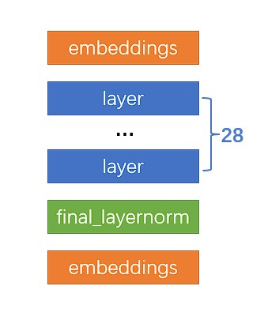

# ChatGLM_MultiGPUCPU_eval
简易实现ChatGLM单机调用多个计算设备（GPU、CPU）进行推理
> ❗在大多数情况下并不能加速推理，旨在使更低端的设备可用更高精度的推理
## 推理
### 1.从仓库下载 MultiDevices.py
[MultiDevices.py](https://raw.githubusercontent.com/ChaimEvans/ChatGLM_MultiGPUCPU_eval/main/MultiDevices.py)
### 2.加载模型
参考[官方文档](https://github.com/THUDM/ChatGLM-6B)
```python
from transformers import AutoTokenizer, AutoModel
tokenizer = AutoTokenizer.from_pretrained("THUDM/chatglm-6b", trust_remote_code=True)
model = AutoModel.from_pretrained("THUDM/chatglm-6b", trust_remote_code=True).half()
```
### 3.调用函数
```python
import MultiDevices

MultiDevices.GPU_precision = 'int8'
MultiDevices.embeddings = 'cpu'
MultiDevices.layers = {
                        'cuda:1': '1-12',
                        'cuda:0': '13-24',
                        'cpu': '25-28'
                    }
MultiDevices.final_layernorm = 'cpu'

model = MultiDevices.ConfigMultiDevices(model)
```
输出
```
word_embeddings -> cpu
layer 0 -> int8 -> cuda:0
layer 1 -> int8 -> cuda:0
layer 2 -> int8 -> cuda:0
layer 3 -> int8 -> cuda:0
layer 4 -> int8 -> cuda:0
layer 5 -> int8 -> cuda:0
layer 6 -> int8 -> cuda:0
layer 7 -> int8 -> cuda:0
layer 8 -> int8 -> cuda:0
layer 9 -> int8 -> cuda:0
layer 10 -> int8 -> cuda:0
layer 11 -> int8 -> cuda:0
layer 12 -> int8 -> cuda:1
layer 13 -> int8 -> cuda:1
layer 14 -> int8 -> cuda:1
layer 15 -> int8 -> cuda:1
layer 16 -> int8 -> cuda:1
layer 17 -> int8 -> cuda:1
layer 18 -> int8 -> cuda:1
layer 19 -> int8 -> cuda:1
layer 20 -> int8 -> cuda:1
layer 21 -> int8 -> cuda:1
layer 22 -> int8 -> cuda:1
layer 23 -> int8 -> cuda:1
layer 24 -> cpu
layer 25 -> cpu
layer 26 -> cpu
layer 27 -> cpu
final_layernorm -> cpu
lm_head -> cpu
hooked.
```
正常使用
```python
model = model.eval()
response, history = model.chat(tokenizer, "你好", history=[])
print(response)
你好👋!我是人工智能助手 ChatGLM-6B,很高兴见到你,欢迎问我任何问题。
```
## 函数说明

|参数|类型|说明|
|----|:-:|---|
|GPU_precision|str|模型量化精度 fp16(默认)，int8，int4|
|CPU_precision|str|CPU中的模型精度 fp32(默认)，bf16|
|embeddings|str|embeddings层使用的设备|
|layers|object|layers各层使用的设备|
|final_layernorm|str|final_layernorm层使用的设备|
## 已测试
> 请根据自身情况调节
### FP16
```python
MultiDevices.GPU_precision = 'fp16' # 或者不设置
```
#### 8G GPU + 8G GPU
> NVIDIA Tesla P4 + NVIDIA P104-100
```python
MultiDevices.embeddings = 'cuda:0'
MultiDevices.layers={
                        'cuda:0': '1-14',
                        'cuda:1': '15-28'
                    }
MultiDevices.final_layernorm = 'cuda:1'
```
#### 8G GPU + 8G GPU + CPU
> NVIDIA Tesla P4 + NVIDIA P104-100
```python
MultiDevices.embeddings = 'cpu',
MultiDevices.layers={
                        'cuda:0': '1-14',
                        'cuda:1': '15-28'
                    }
MultiDevices.final_layernorm = 'cuda:1'
```
### INT8
```python
MultiDevices.GPU_precision = 'int8'
```
#### 8G GPU + CPU
> NVIDIA Tesla P4
```python
MultiDevices.embeddings = 'cpu',
MultiDevices.layers={
                        'cuda:0': '1-28',
                    }
MultiDevices.final_layernorm = 'cuda:1'
```
#### 6G GPU + CPU
> NVIDIA Tesla P4
```python
MultiDevices.embeddings = 'cpu',
MultiDevices.layers={
                        'cuda:1': '1-24',
                        'cpu':'25-28'
                    }
MultiDevices.final_layernorm = 'cpu'
```
### INT4
```python
MultiDevices.GPU_precision = 'int4'
```
#### 4G GPU + CPU
> NVIDIA Tesla P4 4G （关闭above 4g）
```python
MultiDevices.embeddings = 'cpu',
MultiDevices.layers={
                        'cuda:0': '1-24',
                        'cpu': '25-28'
                    }
MultiDevices.final_layernorm = 'cpu'
```
推荐使用已量化的int4模型，并确认CPU Kernel编译成功
